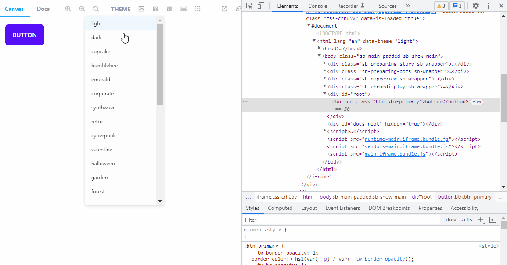

i<!-- README START -->

# Storybook Addon Theme Changer

<div align="center">

<a href="https://github.com/kwatanwa17/storybook-addon-theme-changer">

</a>
<a href="https://www.npmjs.com/package/storybook-addon-theme-changer">

</a>
<a href="https://www.npmjs.com/package/storybook-addon-theme-changer">

</a>
<a href="https://github.com/intuit/auto">

</a>

</div>



A simple addon for changing theme on Storybook.

This addon just controls themes such as **light** and **dark**, adding **data-theme** attribute of html tag.

It works nicely with libraries like [daisyUI](https://github.com/saadeghi/daisyui).

Inspired by [theme-change](https://github.com/saadeghi/theme-change)

## Getting Started

Add this addon to the `.storybook/main.js` file.

```{javascript}
module.exports = {
  ...
 addons: [
     // your addons here
     "storybook-addon-theme-changer"
  ],
};
```

Add your themes to the `.storybook/preview.js` file

```{javascript}
...
export const globalTypes = {
 themes: {
   defaultValue: [
     "light",
     "dark",
     ...
   ],
 },
```
